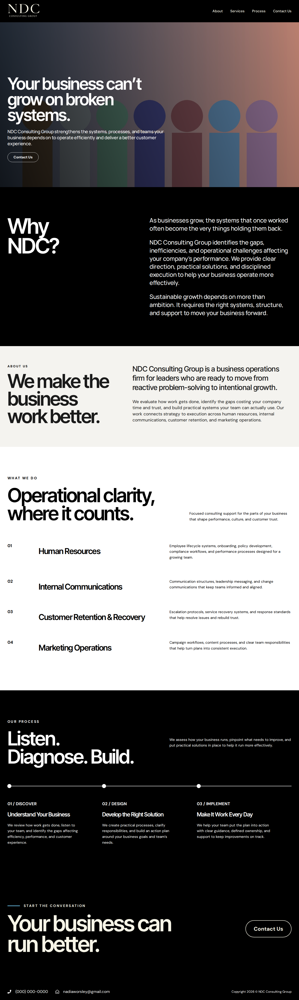

# NDC Consulting Group: website (Elementor + Hello)

This folder has the Elementor templates for the site. The theme and plugin they rely on are in `../wordpress/`.

| File | What it is |
| --- | --- |
| `../wordpress/ndc-hello-child.zip` | **NDC Hello Child** theme. It puts the site header and footer on every page and includes the NDC logo. |
| `../wordpress/ndc-contact-form.zip` | The contact form plugin, with spam protection. It emails each enquiry to **nadiaworsley@gmail.com**. |
| `ndc-header.json` | **NDC Site Header**: the logo, About / Services / Process links, and a Contact Us button. |
| `ndc-footer.json` | **NDC Site Footer**: one black bar with the phone number and email on the left and the copyright on the right. |
| `ndc-homepage.json` | The homepage content. |
| `ndc-contact.json` | The contact page content. |

### How the header and footer work

The header and footer are **separate templates**. You edit each one once in Elementor (*Templates → Saved Templates → NDC Site Header / NDC Site Footer → Edit with Elementor*), and the change appears on every page. The pages themselves contain only their own content.

**Setup is automatic.** The theme includes both templates. The first time you open the WordPress admin with the theme active, it imports any that are missing and selects them.

**If something isn't showing:** go to **Appearance → NDC Site Status**. It shows a ✅ or ❌ for each piece:
- the active theme
- Hello Elementor
- Elementor
- the header and footer templates
- the logo files

Click **Repair header & footer** to re-import both templates and clear Elementor's cache.

**If one page shows the header and another doesn't:** the **Pages** list at the bottom of the same status page checks each page. Pages built from the first NDC templates used the *Elementor Canvas* layout and had an old header and footer built into the page, so they hide the site header with the logo. Click **Fix pages** to:
- switch those pages to *Elementor Full Width*
- remove the old built-in header and footer
- keep a backup of each page, which **Undo fix** restores

**The logo always appears.** It's embedded directly in the header and footer templates. If the Elementor templates can't be found at all, the theme shows its own built-in header and footer, which also include the logo and links.

Free Elementor can't share a header and footer across pages by itself; that feature is the Pro "Theme Builder". The NDC Hello Child theme does it instead:
- **Automatic:** it finds the templates named exactly **NDC Site Header** and **NDC Site Footer**.
- **Choosing others:** to use templates with different names, pick them in *Appearance → Customize → NDC Header & Footer*.
- **Fallback:** if neither template exists, the theme's own built-in header and footer appear.
- **Elementor Pro:** if you add Pro later, its Theme Builder header and footer take over automatically.

### Logo

The theme includes the logo in two colours. Both are cropped, transparent PNGs:
- `assets/img/ndc-logo-light.png`: cream, for the dark header and footer.
- `assets/img/ndc-logo-dark.png`: black, for light backgrounds.

**Placing the logo:** add a **Shortcode** widget containing:

```
[ndc_logo variant="light" height="64" height_mobile="46"]
```

- `variant="dark"` gives the black version.
- `link="no"` stops the logo linking to the homepage.

**Replacing the logo:** to update it later, swap those two files for new ones with the same names.

**Homepage sections** (between the site header and footer):
1. **Hero**: the team photo with "Your business can’t grow on broken systems.", a supporting line, and a small **Contact Us** button that goes to the contact page.
2. **Why NDC?**: black background, white text; the copy from *Why NDC Consulting Group – Homepage.docx*.
3. **About us**.
4. **What we do**: white background, black text, no dividing lines. Human Resources, Internal Communications, Customer Retention & Recovery, Marketing Operations.
5. **Our process**: black background, white text. Discover → Design → Implement, with copy from *Our Process – Biz Ops Website.docx*.
6. **Start the conversation**: a call to action.

**Contact page:** a form for Full Name (first and last), Company / Organization, Email and Message. Every field is required.

**Links:** every Contact button on the site goes to `/contact/`. Your email address never appears on the site itself, so spam bots can't harvest it.

The pages use only **free Elementor** widgets, and the form comes from the included plugin, so you don't need Elementor Pro. Everything was tested on WordPress 6.9.4, Hello Elementor 3.4.7 and Elementor 4.0.0.



*The preview uses a stand-in graphic for the hero photo; your site shows the Higgsfield team photo.*

## Install

1. **Themes:** install **Hello Elementor** (*Appearance → Themes → Add New*), but don't activate it. It must be installed for the child theme to work.
   Then go to *Appearance → Themes → Add New → Upload Theme* → choose `wordpress/ndc-hello-child.zip` → **Install** → **Activate**.
2. **Elementor:** install and activate **Elementor**.
   On Elementor 3.x, check that *Elementor → Settings → Features → Flexbox Container* is **Active**.
3. **Contact form plugin:** *Plugins → Add New → Upload Plugin* → choose `wordpress/ndc-contact-form.zip` → **Install Now** → **Activate**.
4. **Import all four templates:** *Templates → Saved Templates → Import Templates*. Import `ndc-header.json`, `ndc-footer.json`, `ndc-homepage.json` and `ndc-contact.json`.
   The header and footer appear on every page as soon as they're imported; there's nothing else to set up.
5. **Create the pages:**
   - **Home:** *Pages → Add New* → title **Home** → **Edit with Elementor**. Click the folder icon → **My Templates** → **Insert** next to *NDC Consulting Group – Homepage*.
   - **Contact:** *Pages → Add New* → title **Contact**. The web address must be `/contact/`, which WordPress sets automatically from that title. → **Edit with Elementor** → insert *NDC Consulting Group – Contact*.
   - **For both pages:** open the page settings (gear icon) → **Page Layout → Elementor Full Width** → **Publish**.
     Use *Full Width*, not *Canvas*. Canvas hides the site header and footer.
6. **Set the homepage:** *Settings → Reading → A static page → Homepage: Home*.
7. **Browser-tab icon:** go to *Appearance → Customize → Site Identity → Site Icon* and upload `wordpress/ndc-hello-child/assets/img/ndc-site-icon.png`. It's a cream "N" from the logo on the dark brand colour.

**Updating from an earlier version:**
- **Theme:** upload the new `ndc-hello-child.zip` and choose **Replace current with uploaded**. The next time you open the WordPress admin, the theme updates the **NDC Site Header** and **NDC Site Footer** templates to the new design by itself. It keeps their names and settings and saves a backup of the previous version.
- **Pages:** delete the old *NDC Consulting Group – Homepage* and *– Contact* templates under *Templates → Saved Templates*. Import the new ones, then re-insert them into Home and Contact (open the page in Elementor, delete its old content, then **Insert** the template).

## Hero photo

The hero uses a photo generated with Higgsfield: a diverse team around a conference table, led by a Black woman. A dark gradient over the left side keeps the white headline readable.

**How it gets onto your site:** the homepage template points to the photo's online address. When you import the template, Elementor downloads the photo into your **Media Library** automatically.

**If the hero shows a grey placeholder instead:** the download didn't work (some hosts block outside downloads). To fix it:
1. Download the photo from your Higgsfield account and upload it to the Media Library.
2. Edit **Home** with Elementor and click the hero section to select it.
3. Go to **Style → Background → Image** → choose the photo → **Update**.

**Page speed:** the photo is a large PNG. An image-optimisation plugin (for example **Smush** or **ShortPixel**) will compress it so the page loads faster.

## Spam protection

The form stops bots without a CAPTCHA puzzle for real visitors. Each submission has to pass all of these checks:

| Check | What it catches |
| --- | --- |
| **Hidden trap field** | People never see it; bots fill it in. |
| **Signed form token** | Rejects forms posted directly to the site without loading the page. |
| **Human-interaction proof** | JavaScript only marks the form valid after a real key press or tap. Most bots never trigger that. |
| **Time trap** | Rejects submissions made less than 4 seconds after the page loaded. |
| **Rate limit** | At most 5 messages per visitor per hour. |
| **Content rules** | Blocks links in names, `[url]`/HTML link spam, and messages with more than 2 links. It also honours *Settings → Discussion → Disallowed Comment Keys*. |

**Bots are shown a fake "sent" message**, so they get no signal to adapt to. Nothing reaches your inbox.

### Cloudflare Turnstile

Turnstile adds Cloudflare's own check on top of the checks above. It's free, and most real visitors pass without clicking anything. The check appears just above **Send Message**.

**To switch it on:**
1. Log in at **dash.cloudflare.com** and open **Turnstile**.
2. Click **Add widget**. Name it "NDC Contact Form" and add the site's domain.
3. **Widget mode:** choose **Managed**.
4. Copy the **Site Key** and **Secret Key** into *Settings → NDC Contact Form → Cloudflare Turnstile* → **Save Changes**.

**Checking it's on:** *Appearance → NDC Site Status* shows **Cloudflare Turnstile: on**. Send yourself one test message to confirm the whole thing works end to end.

**Keep the Secret Key private:** enter it only in WordPress.

## Where enquiries go

- **Email:** every enquiry is emailed to **nadiaworsley@gmail.com**. Hitting **Reply** answers the person who wrote in. To change the address or add another, go to *Settings → NDC Contact Form*.
- **Saved copy:** each enquiry is also saved in WordPress under **Enquiries** in the admin menu, so nothing is lost if an email goes astray.

**Email delivery:** many hosts send WordPress email in a way Gmail treats as spam. After launching, send yourself a test enquiry. If it doesn't arrive, or lands in Spam, install the free **WP Mail SMTP** plugin and connect it to your email provider.

## Things to review

| Where | What |
| --- | --- |
| **Footer phone number** | **Placeholder:** `(000) 000-0000`. Replace it in *Templates → Saved Templates → NDC Site Footer → Edit with Elementor* by clicking the phone line and editing both the **Text** and the **Link** (`tel:+1XXXXXXXXXX`). Or send me the number and I'll update the template. |
| Footer | The copyright year is plain text (`2026`). |

## Design tokens

| Token | Value | Used for |
| --- | --- | --- |
| Black | `#000000` | Header, hero, "Why NDC?", "Our Process", call to action, footer |
| White | `#FFFFFF` | Text on black sections; "What We Do" background |
| Ink | `#1A1A1A` | Text on light sections |
| Cream | `#F6F4E6` | Logo and header links |
| Sky | `#6EC6EE` | Accent line above "Start the conversation" |
| About / Contact background | `#F4F3EF` | |

**Fonts (loaded automatically from Google Fonts by Elementor):**
- **Inter Tight** for headlines.
- **Manrope** for the large "Why NDC?" paragraphs.
- **DM Sans** for body text, labels, buttons and the form.

## Regenerating the templates

Both templates are generated by `tools/build_ndc_homepage.py`. To regenerate them after editing it:

```bash
python3 tools/build_ndc_homepage.py
```

Once the templates are imported, you can edit the pages directly in Elementor. The script is only for bulk changes.
